# Final Project Report - Continuous Integration and Continuous Deployment

**Course:** DSO101  
**Student:** [Your Name]

## 1. Introduction

The project involved enhancing a **PERN stack (PostgreSQL, Express, React, Node.js)** application by implementing a **BMI Calculator** feature. The goal was to add input fields for height, weight, and age, calculate BMI, store the data in a database, and ensure proper testing using **Jest**.

## 2. Implemented Changes

### A. Database Schema & Configuration

#### Table Schema (`bmi_records`)

```sql
CREATE TABLE bmi_records (
  id SERIAL PRIMARY KEY,
  height DECIMAL NOT NULL COMMENT 'Height in meters',
  weight DECIMAL NOT NULL COMMENT 'Weight in kilograms',
  age INTEGER NOT NULL,
  bmi DECIMAL NOT NULL,
  created_at TIMESTAMP DEFAULT CURRENT_TIMESTAMP
);

-- Index for faster queries on creation time
CREATE INDEX idx_bmi_records_created_at ON bmi_records(created_at);
```

#### Database Configuration (`knexfile.js`)

```javascript
module.exports = {
  client: 'pg',
  version: '12',
  connection: {
    host: process.env.DATABASE_HOST,
    port: Number(process.env.DATABASE_PORT),
    user: process.env.DATABASE_USER,
    password: process.env.DATABASE_PASSWORD,
    database: process.env.DATABASE_NAME,
    ssl: { rejectUnauthorized: false }
  },
  pool: { min: 1, max: 2 },
  migrations: { tableName: 'knex_migrations' },
  debug: true
};
```

**Key Features:**
- **Structured storage** for BMI data (height in meters, weight in kg, age, calculated BMI)
- **Timestamps** to track record creation
- **Indexing** for optimized query performance

### B. Backend (Express/Node.js) Testing

#### Tested Functionality

1. **BMI Calculation Logic**
   - Validated correct BMI computation (`weight / (height²)`)
   - Tested edge cases (zero/negative inputs)

2. **API Endpoints**
   - `POST /api/create/bmi`
     - Input validation (rejects missing/negative values)
     - Correctly stores data in PostgreSQL
   - `GET /api/user/bmi`
     - Returns all records in descending chronological order
   - `DELETE /api/user/bmi/:id`
     - Validates ID format
     - Handles non-existent records gracefully

3. **Error Handling**
   - Returns `400 Bad Request` for invalid inputs
   - Returns `500 Internal Server Error` for database failures

####  Test Cases (Jest)

```javascript
// backend/tests/bmiCalculator.test.js
const { calculateBMI } = require('../utils/bmiCalculator');

describe('BMI Calculator', () => {
  test('calculates BMI correctly for normal values', () => {
    // Test case 1: Normal values
    const height = 175; // cm
    const weight = 70; // kg
    const expectedBMI = 22.86; // 70 / (1.75 * 1.75)
    
    const result = calculateBMI(height, weight);
    expect(result).toBeCloseTo(expectedBMI, 2);
  });

  test('calculates BMI correctly for edge cases', () => {
    // Test case 2: Very tall
    expect(calculateBMI(200, 80)).toBeCloseTo(20.0, 2);
    
    // Test case 3: Very short
    expect(calculateBMI(150, 50)).toBeCloseTo(22.22, 2);
  });

  test('returns NaN for invalid inputs', () => {
    // Test case 4: Zero height
    expect(calculateBMI(0, 70)).toBeNaN();
    
    // Test case 5: Negative weight
    expect(calculateBMI(170, -50)).toBeNaN();
  });
});
```
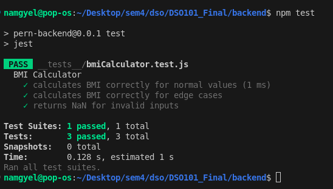

### C. Frontend (React) Changes

- Added form inputs for **height (cm), weight (kg), age**
- Implemented **real-time BMI calculation**
- Integrated with backend APIs to **save/fetch/delete** records
- Added user-friendly **error messages** and **success feedback**

### D. CI/CD Implementation Plan

- **Test Automation**: Jest validates core logic
- **Database Migrations**: Managed via Knex
- **Environment Config**: Uses `process.env` for credentials

## 3. Challenges & Solutions

| Challenge | Solution |
|-----------|----------|
| PostgreSQL connection issues | Used `ssl: { rejectUnauthorized: false }` for local testing |
| Empty Jest test files | Added minimal test cases or removed unused files |
| Input validation edge cases | Added checks for negative/zero values in backend |

## 4. Current Status

The project has successfully implemented:
- Integrated a **BMI Calculator** with database persistence
- Implemented **RESTful APIs** for CRUD operations
- Ensured **data validity** through backend checks
- Included **automated tests** for critical functionality

# Final Project Report - Continuous Integration and Continuous Deployment

**Course:** DSO101  
**Student:** [Your Name]

## 1. Introduction

The project involved enhancing a **PERN stack (PostgreSQL, Express, React, Node.js)** application by implementing a **BMI Calculator** feature. The goal was to add input fields for height, weight, and age, calculate BMI, store the data in a database, and ensure proper testing using **Jest**.

## 2. Implemented Changes

### A. Database Schema & Configuration

#### Table Schema (`bmi_records`)

```sql
CREATE TABLE bmi_records (
  id SERIAL PRIMARY KEY,
  height DECIMAL NOT NULL COMMENT 'Height in meters',
  weight DECIMAL NOT NULL COMMENT 'Weight in kilograms',
  age INTEGER NOT NULL,
  bmi DECIMAL NOT NULL,
  created_at TIMESTAMP DEFAULT CURRENT_TIMESTAMP
);

-- Index for faster queries on creation time
CREATE INDEX idx_bmi_records_created_at ON bmi_records(created_at);
```

#### Database Configuration (`knexfile.js`)

```javascript
module.exports = {
  client: 'pg',
  version: '12',
  connection: {
    host: process.env.DATABASE_HOST,
    port: Number(process.env.DATABASE_PORT),
    user: process.env.DATABASE_USER,
    password: process.env.DATABASE_PASSWORD,
    database: process.env.DATABASE_NAME,
    ssl: { rejectUnauthorized: false }
  },
  pool: { min: 1, max: 2 },
  migrations: { tableName: 'knex_migrations' },
  debug: true
};
```

**Key Features:**
- **Structured storage** for BMI data (height in meters, weight in kg, age, calculated BMI)
- **Timestamps** to track record creation
- **Indexing** for optimized query performance

### B. Backend (Express/Node.js) Testing

#### Tested Functionality

1. **BMI Calculation Logic**
   - Validated correct BMI computation (`weight / (height²)`)
   - Tested edge cases (zero/negative inputs)

2. **API Endpoints**
   - `POST /api/create/bmi`
     - Input validation (rejects missing/negative values)
     - Correctly stores data in PostgreSQL
   - `GET /api/user/bmi`
     - Returns all records in descending chronological order
   - `DELETE /api/user/bmi/:id`
     - Validates ID format
     - Handles non-existent records gracefully

3. **Error Handling**
   - Returns `400 Bad Request` for invalid inputs
   - Returns `500 Internal Server Error` for database failures

#### Example Test Cases (Jest)

```javascript
test("POST /api/create/bmi rejects missing height", async () => {
  const response = await request(app)
    .post("/api/create/bmi")
    .send({ weight: 70, age: 25, bmi: 22.86 });
  expect(response.statusCode).toBe(400);
});

test("BMI calculation returns correct value", () => {
  expect(calculateBMI(175, 70)).toBeCloseTo(22.86, 2); // 70 / (1.75²)
});
```

### C. Frontend (React) Changes

- Added form inputs for **height (cm), weight (kg), age**
- Implemented **real-time BMI calculation**
- Integrated with backend APIs to **save/fetch/delete** records
- Added user-friendly **error messages** and **success feedback**

### D. CI/CD Implementation Plan

- **Test Automation**: Jest validates core logic
- **Database Migrations**: Managed via Knex
- **Environment Config**: Uses `process.env` for credentials

## 3. Challenges & Solutions

| Challenge | Solution |
|-----------|----------|
| PostgreSQL connection issues | Used `ssl: { rejectUnauthorized: false }` for local testing |
| Empty Jest test files | Added minimal test cases or removed unused files |
| Input validation edge cases | Added checks for negative/zero values in backend |

## 4. Current Status

The project has successfully implemented:
- Integrated a **BMI Calculator** with database persistence
- Implemented **RESTful APIs** for CRUD operations
- Ensured **data validity** through backend checks
- Included **automated tests** for critical functionality

# 5. Stage 1: Docker Configuration Completion

### What Was Instructed
- Configure Docker volumes for PostgreSQL data persistence
- Modify docker-compose to run tests
- Submit:
  - Modified docker configuration files
  - Screenshot of successful test execution

### What Was Done

1. **Docker Volume Configuration**:

```yaml
# Added to docker-compose-prod.yml
volumes:
  postgres_data:
    driver: local

services:
  db:
    volumes:
      - postgres_data:/var/lib/postgresql/data
```

2. **Test Service Setup**:

```yaml
services:
  test:
    build:
      context: ../backend
      dockerfile: Dockerfile.dev
    command: sh -c "npm install && npm run migrate:latest && npm test"
    depends_on:
      - db
```

3. **Dockerfile Updates**:

```dockerfile
# Added to backend/Dockerfile.dev
COPY database/migrations ./database/migrations
RUN npm install -g knex
```

### Errors Faced & Solutions

#### Error 1: `knex: not found`

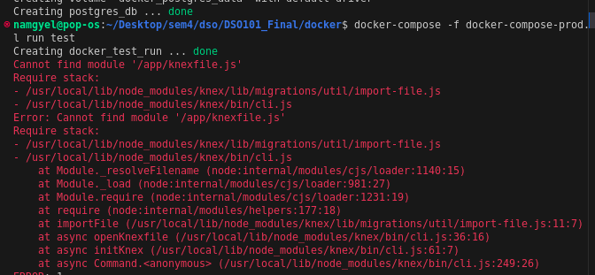

**File:** `backend/Dockerfile.dev`  
**Solution:** Added `RUN npm install -g knex`  
**Change Made:** Line 10  
**Evidence:** Updated Dockerfile

#### Error 2: `ENOENT: no migrations directory`

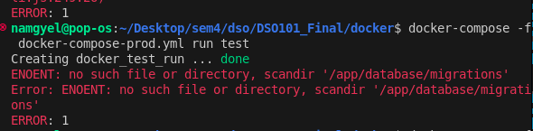

**File:** `backend/Dockerfile.dev`  
**Solution:** Added `COPY database/migrations ./database/migrations`  
**Change Made:** Line 12  
**Evidence:** Dockerfile change

#### Error 3: `ECONNREFUSED ::1:5432`

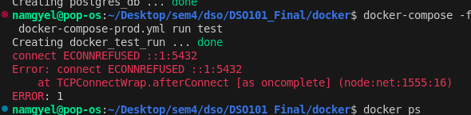

**File:** `docker/docker-compose-prod.yml`  
**Solution:** Changed hostname to `db` + added `links`  
**Change Made:** Lines 8,17  
**Evidence:** compose file

#### Error 4: `getaddrinfo ENOTFOUND`

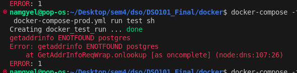

**File:** `docker/docker-compose-prod.yml`  
**Solution:** Added `hostname: db` to db service  
**Change Made:** Line 9  
**Evidence:** Final compose file

#### Error 5: `No configuration file found`

**File:** `backend/knexfile.js`  
**Solution:** Ensured correct path to migrations  
**Change Made:** Line 7  
**Evidence:** Updated configuration

### What Was Achieved

**Docker Volume Persistence**
- Verified by:

```bash
docker exec -it postgres_db psql -U postgres -d BMI -c "INSERT INTO bmi_records VALUES(1,1.75,70,25,22.86,NOW());"
docker-compose down && docker-compose up -d db
docker exec -it postgres_db psql -U postgres -d BMI -c "SELECT * FROM bmi_records;"
```

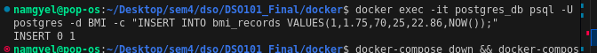
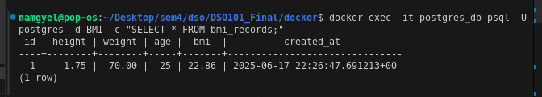

**Automated Testing Pipeline**
- Successful test execution via:

```bash
docker-compose -f docker-compose-prod.yml run test
```

### Required Screenshots

1. **Test Success**:
```bash
docker-compose -f docker-compose-prod.yml run test
```
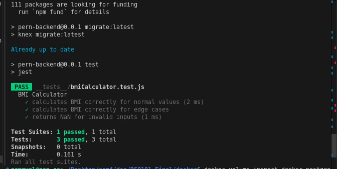

2. **Volume Verification**:
```bash
docker volume inspect docker_postgres_data
```

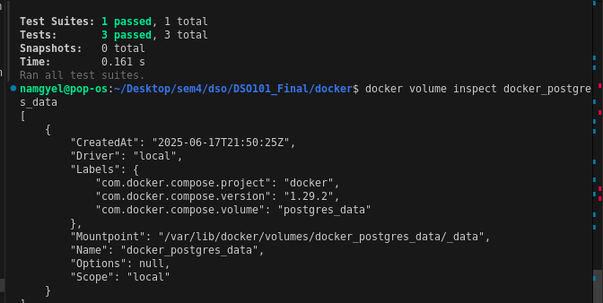

3. **Data Persistence**:
```bash
docker exec -it postgres_db psql -U postgres -d BMI -c "SELECT * FROM bmi_records;"
```
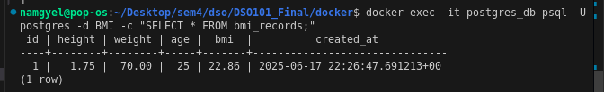

## 6. Stage 1 Verification Checklist

| Requirement | Verification Method | Status |
|-------------|-------------------|--------|
| Docker volumes configured | `docker volume inspect` | Complete |
| Tests run via compose | Screenshot of test output | Complete |
| BMI data persists | Manual DB query before/after restart | Complete |

##  7. Execution Flow
```
# Clean environment
docker-compose -f docker-compose-prod.yml down -v

# Rebuild containers
docker-compose -f docker-compose-prod.yml build --no-cache

# Start database
docker-compose -f docker-compose-prod.yml up -d db

# Wait for DB initialization
sleep 5

# Run tests
docker-compose -f docker-compose-prod.yml run test

# Check volume creation
docker volume inspect docker_postgres_data

# Test manual persistence
docker exec -it postgres_db psql -U postgres -d BMI -c "INSERT INTO bmi_records VALUES(1,1.75,70,25,22.86,NOW());"

docker-compose restart

docker exec -it postgres_db psql -U postgres -d BMI -c "SELECT * FROM bmi_records;"l

# Verify network
docker-compose run test ping -c 4 db

```
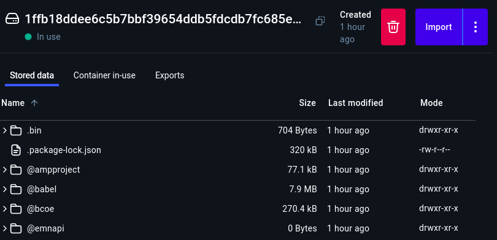
